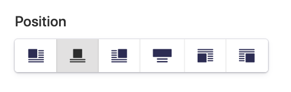

[](https://github.com/riasvdv/statamic-position-fieldtype/releases)
[](https://scrutinizer-ci.com/g/riasvdv/statamic-position-fieldtype)
[](https://styleci.io/repos/181859139)

# Position Fieldtype plugin for Statamic

Provide better UX to clients by letting them pick from icons.



## License

Position requires a license to be used while on a production site.  
You can purchase one at https://statamic.com/marketplace/addons/position-fieldtype.

You may use Position without a license while Statamic is in [Trial mode](https://docs.statamic.com/knowledge-base/trial-mode).

## Installation

To install the plugin, download the plugin and place it in your `site/addons` folder.

## Using Position

Add the fieldtype to your fieldset. You can choose to hide certain positions, by default they are all visible.

```yaml
sections:
  main:
    display: Main
    fields:
      position:
        type: position
        options:
          left: true
          center: true
          right: true
          full: true
          drop-left: true
          drop-right: true
        default: center
```

## Using Position

The output of the fieldtype is equal to the keys in the options array.

```twig
{{ position }} // center
```

Brought to you by [Rias](https://rias.be)
